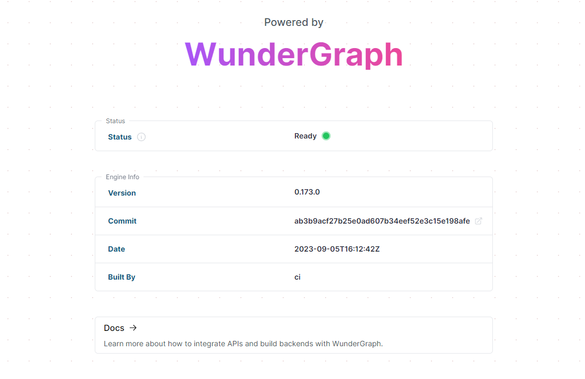

# Wundergraph CI/CD pipeline

<a href="https://dash.elest.io/deploy?source=cicd&social=dockerCompose&url=https://github.com/elestio-examples/wundergraph"></a>

Deploy Wundergraph server with CI/CD on Elestio


<br/>
<br/>

# Steps to clone this repository and run locally

### Step 1: Clone this repository

```
git clone YOUR_REPOSITORY_URL
```

### Step 2: Make some changes and push

Try to make some change in your Wundergraph project then push to the git repository

After few seconds to few minutes your change will be deployed on your CI/CD target 🚀

# Once deployed ...

You can open Wundergraph UI here:

    URL: https://[CI_CD_DOMAIN]
    login: admin
    password: [ADMIN_PASSWORD]

# Workspace

You can modify or add new files in my-project/.wundergraph
If you want to create a new endpoint, just create a new folder in my-project/.wundergraph/operations and add into this folder a graphql file.

The new endpoint will be like https://[CI_CD_DOMAIN]/operations/`<NAME_OF_YOUR_FOLDER>`/`<NAME_OF_YOUR_FILE_WITHOUT_.graphql>`

# Examples

You can access to your endpoint via curl command. You can try it with the endpoint that we have implemented like that:

    curl -v --get --user 'admin:[ADMIN_PASSWORD]' --data-urlencode 'wg_variables={"countryCode": "US"}' 'https://[CI_CD_DOMAIN]/operations/country-weather/CountryWeather'

for more examples you can read the <a href="https://docs.wundergraph.com/docs/examples" target="_blank">WunderGraph Documentation</a>
